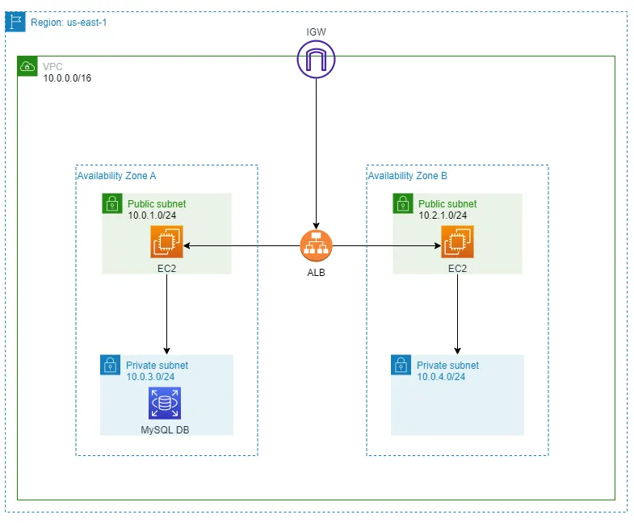

###### Problem Statement

Develop a Modularised Terraform Script that should be able to create resources as per below

Architecture Diagram.

###### Solution:

1. I had acloudguru subscription and with that I provisioned an AWS sandbox.
2. Obtained the Access Key Id and Secret Access Key , configured in my local machine under .aws config file
3. Logged in to AWS console and create an ec2 key pair "my-key-pair"
4. Created main.tf in local matching the given architechture diagram (Assumed there is a MySQL DB in AZ-B and created the terraform file)
5. Ran terraform init, plan, apply commands and the resource got provisioned.
